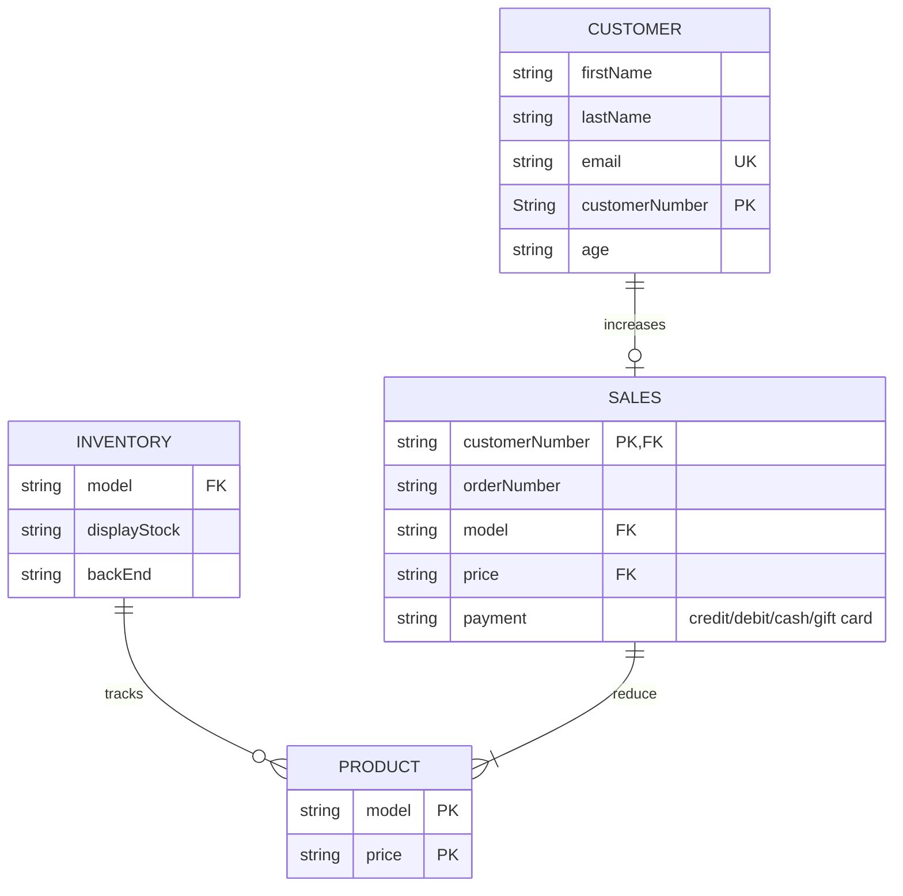

# -NikeStore_ERD.md
Lab 2 Mermaid Diagram-Database design/entity relationship diagram scenario

### Summary    
When a __customer__ purchases a __product__ (increases __sales__ and decreases __product__), customer information is collected and a customer number is generated. __Sales__ references the customer number from customer information and generates a unique order number. During the sale, the price and product model is retrieved from __product__ details. __Inventory__ (which tracks product) records the product model (from __product__ details) and both the display and backend stock.   
This model collects customer behavior data, organizes purchase information, and monitors inventory and profit.   
Using this information, a business can: 
* Otimize marketing campaigns 
* Create a record of fulfilled purchases 
* Predict demand 
* Ensure satisfactory inventory levels 
* Reduce shrink
* Measure and maximize profitability 
