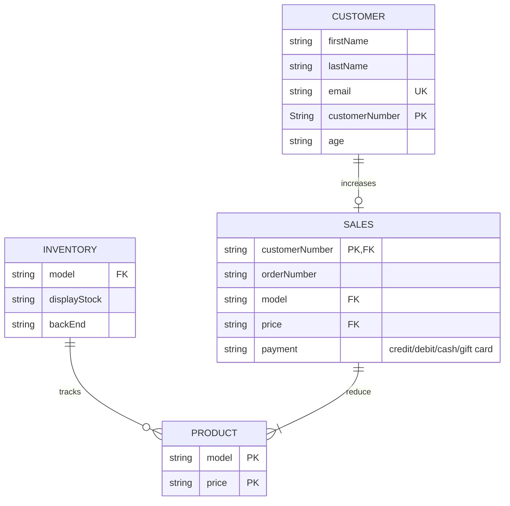

# -NikeStore_ERD.md
Lab 2 Mermaid Diagram-Database design/entity relationship diagram scenario

When a customer purchases a product (increases sales and decreases product), customer information is collected and a customer number is generated. Sales references the customer number from customer information and generates a unique order number. During the sale, the price and product model is retrieved from product details. Inventory management records model (from product details) and both display and backend stock. This model collects customer behavior data, organizes purchase information, and monitors inventory and profit. This information can otimize marketing campaigns, create a record of fulfilled purchases, predict demand, ensure satisfactory inventory levels, reduce shrink, as well as measure and maximize profitability. 
